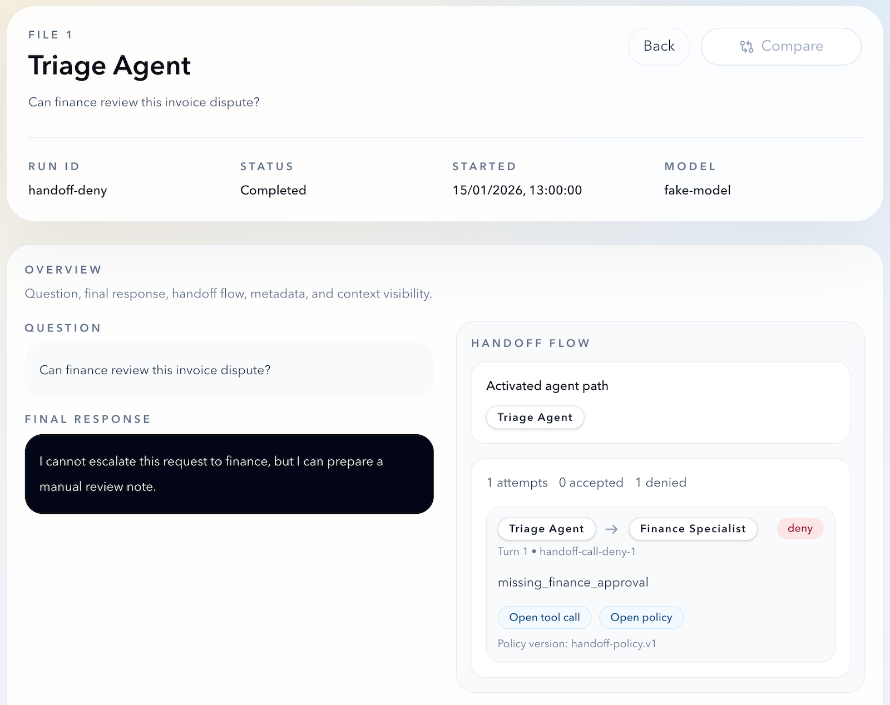

# @axiastudio/aioc

AIOC is a governance-first SDK for LLM agents: models can propose actions, while deterministic policies and runtime controls enforce decisions.
It provides default-deny gates for tools and handoffs, end-to-end auditability (run records, prompt snapshots, request fingerprints), and a foundation for verifiable iteration on prompts and policies.
AIOC is designed for enterprise and public-sector contexts with privacy-by-design and high-accountability (AI Act-style) governance requirements.

Project home and documentation: [https://axiastudio.github.io/aioc](https://axiastudio.github.io/aioc)

## Release Status

This package is currently in beta and is not production-ready.
Breaking changes may occur before a stable release.

### What Stable Means

AIOC will move out of beta when the core runtime surface is stable, the public documentation matches the actual exported contract, `RunRecord` and replay/compare workflows are considered reliable, and the SDK has been validated in real applications beyond toy examples.

- Beta contract: `docs/BETA-CONTRACT.md`
- Alpha contract (historical): `docs/ALPHA-CONTRACT.md`
- Privacy baseline: `docs/PRIVACY-BASELINE.md`

## Documentation Site

This repository also contains `aioc-docs`, a Starlight documentation app:

- app path: `apps/aioc-docs`
- source of truth for normative documents: `docs/`
- GitHub Pages target: `https://axiastudio.github.io/aioc/`
- start locally: `npm run docs:dev`
- build statically: `npm run docs:build`

The root `docs:*` commands intentionally invoke the app from inside `apps/aioc-docs` so it can use its own Node toolchain.

## Contact

If you want to collaborate or provide feedback, write to `tiziano.lattisi@axia.studio`.

## Install

```bash
npm install @axiastudio/aioc
```

## Quickstart

```ts
import "dotenv/config";
import { Agent, run, setupMistral } from "@axiastudio/aioc";

setupMistral(); // reads MISTRAL_API_KEY from env

const agent = new Agent({
  name: "Hello Agent",
  model: "mistral-small-latest",
  instructions: "Answer in 2 short sentences.",
});

const result = await run(
  agent,
  "In one sentence, what is a deterministic policy gate in an agent SDK?",
);
console.log(result.finalOutput);
```

## Core API

- `Agent`, `RunContext`
- optional `Agent.promptVersion` to version resolved instructions
- `Tool`, `tool(...)`
- handoffs via `Agent({ handoffs: [...] })`
- `run(...)` with streaming support (`stream` defaults to `false`)
- policy helpers `allow(...)` / `deny(...)` / `requireApproval(...)`
- provider setup helpers `setupMistral(...)`, `setupOpenAI(...)`, `setupProvider(...)`
- run logger hook `run(..., { logger })`
- run record hook `run(..., { record })`
- run-record utilities `extractToolCalls(...)`, `compareRunRecords(...)`, `replayFromRunRecord(...)`
- JSON helper `toJsonValue(...)`

## Policy Gate (Minimal)

```ts
import { Agent, allow, deny, run, tool, type ToolPolicy } from "@axiastudio/aioc";

const toolPolicy: ToolPolicy<{ actor: { groups: string[] } }> = ({ runContext }) => {
  if (!runContext.context.actor.groups.includes("finance")) {
    return deny("deny_missing_finance_group", {
      denyMode: "tool_result",
      publicReason: "You are not authorized to access this report.",
    });
  }
  return allow("allow_finance_group_access");
};

await run(agent, "Summarize report Q1.", {
  context: { actor: { groups: ["finance"] } },
  policies: { toolPolicy },
});
```

Default behavior is deny when no policy is configured.

`resultMode` is the canonical non-allow delivery mode (`"throw"` or `"tool_result"`). During beta, `denyMode` is still accepted as a compatibility alias for `deny(...)`.

## Run Record (Minimal)

```ts
const records = [] as RunRecord<MyContext>[];

await run(agent, "question", {
  context,
  policies: { toolPolicy },
  record: {
    includePromptText: true,
    contextRedactor: (ctx) => ({
      contextSnapshot: { ...ctx, userId: "[redacted]" },
      contextRedacted: true,
    }),
    sink: (record) => records.push(record),
  },
});
```

Privacy notes:

- `record.includePromptText` defaults to `false`; keep it disabled unless needed.
- `record.contextRedactor` should be considered mandatory for production persistence.
- sink adapters should implement encryption, access controls, retention, and deletion.

## RunRecord Utilities (Minimal)

### `extractToolCalls(...)`

```ts
import { extractToolCalls } from "@axiastudio/aioc";

const calls = extractToolCalls(runRecord);
console.log(calls[0]?.name, calls[0]?.argsHash, calls[0]?.hasOutput);
```

### `compareRunRecords(...)`

```ts
import { compareRunRecords } from "@axiastudio/aioc";

const comparison = compareRunRecords(runRecordA, runRecordB, {
  includeSections: ["response", "toolCalls", "policy", "guardrails", "metadata"],
  responseMatchMode: "exact",
});

console.log(comparison.summary);
console.log(comparison.metrics);
console.log(comparison.differences);
```

### `replayFromRunRecord(...)`

```ts
import { allow, replayFromRunRecord } from "@axiastudio/aioc";

const replay = await replayFromRunRecord({
  sourceRunRecord,
  agent,
  mode: "strict", // live | strict | hybrid
  runOptions: {
    policies: {
      toolPolicy: () => allow("allow_replay"),
    },
  },
});

console.log(replay.result.finalOutput);
console.log(replay.replayStats);
```

`replayFromRunRecord(...)` does not bypass policy enforcement: in `strict` and `hybrid`, provide `runOptions.policies` when tool/handoff execution must be authorized.

## Reference UI Example

This repository also contains `aioc-inspect`, a private reference example UI for visual `RunRecord` analysis:

- path: `apps/aioc-inspect`
- public sample files: `apps/aioc-inspect/public/samples`
- regenerate samples: `npm run inspect:samples`
- purpose: show one possible way to inspect, navigate, and compare `RunRecord` artifacts visually
- scope: experimental, stateless, session-only
- positioning: example application for implementors, not a hosted service or production console

`aioc-inspect` exists to demonstrate the value of the `RunRecord` contract. It should be read as one possible interpretation of the data model, not as the only intended UI for `aioc`.



## Examples

| Command | Purpose | Needs API key |
|---|---|---|
| `npm run example:hello` | Minimal single-agent run | Yes (`MISTRAL_API_KEY`) |
| `npm run example:policy` | Minimal denied tool + policy flow | Yes (`MISTRAL_API_KEY`) |
| `npm run example:tool-policy` | Straight tool + policy flow with allowed execution | Yes (`MISTRAL_API_KEY`) |
| `npm run example:run-record` | Run-record persistence with redaction + audit | Yes (`MISTRAL_API_KEY`) |
| `npm run example:rru:01-extract` | Minimal `extractToolCalls(...)` | No |
| `npm run example:rru:02-compare` | Minimal `compareRunRecords(...)` | No |
| `npm run example:rru:03-replay-strict` | Minimal strict replay | No |
| `npm run example:rru:04-replay-hybrid` | Minimal hybrid replay | No |
| `npm run example:non-regression` | Advanced v1/v2 run-record diff | Yes (`MISTRAL_API_KEY`) |

Notes:

- `example:non-regression` is educational and can be non-deterministic because it uses a live provider.
- canonical examples guide: `docs/CANONICAL-EXAMPLES.md`.

## Test Commands

- `npm run test:unit`
- `npm run test:integration`
- `npm run test:regression`
- `npm run test:ci`

## Project Principles

AIOC adopts the following non-negotiable principles:

- **LLM outside the control plane**: critical decisions remain in deterministic components; the LLM supports but does not govern.
- **End-to-end transparency**: each decision is traceable (inputs, context, prompt/policy version, output).
- **Verifiable corrigibility**: prompts, policies, and materials are versioned, editable, and comparable before/after changes.
- **Non-degeneration validation**: each correction must pass regression tests and quality checks.
- **Bias and misalignment control**: continuous monitoring, dedicated tests, and clear mitigation/escalation mechanisms.
- **Privacy by design and data minimization**: collect and process only what is strictly necessary, protect sensitive data by default (redaction, encryption, retention limits), and provide auditable controls for access and deletion.

## Current Governance Documents

- `docs/RFC-0001-governance-first-runtime.md` (`Accepted`)
- `docs/RFC-0002-policy-gates-for-tools-and-handoffs.md` (`Accepted`)
- `docs/RFC-0003-run-record-audit-trail-and-persistence.md` (`Accepted`)
- `docs/RFC-0004-policy-outcomes-and-approval-model.md` (`Draft`)
- `docs/RFC-0005-suspended-proposals-and-approval-lifecycle.md` (`Draft`)
- `docs/PRIVACY-BASELINE.md`

## Historical Snapshots

- `docs/ALPHA-CONTRACT.md`
- `docs/BETA-CONTRACT.md`
- `docs/BETA-CONTRACT-AUDIT.md`
- `docs/P0-TRIAGE.md`
- `docs/PRIVACY-ADOPTION.md`

## License

- Project license: `MIT` (`LICENSE`)
- Third-party notices: `THIRD_PARTY_NOTICES.md`
